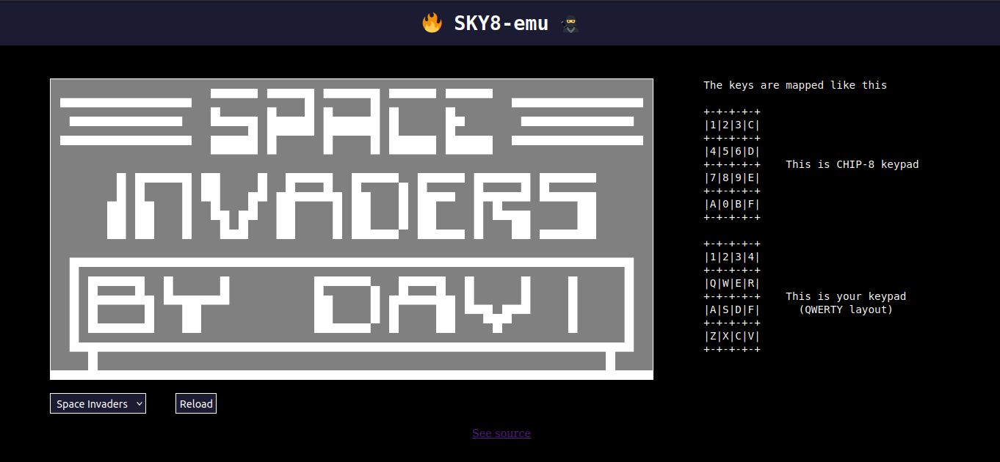

# An attempt to build a chip-8 emulator using Javascript

I started making this as it seemed like a fun project to work on and also because I have used many emulators in the past and wanted to know about how exactly they work.

## Check out the live site here: https://skyhero-admin.github.io/Sky8-emu.js/

### References I used:
- [Chip-8 specs guide](http://devernay.free.fr/hacks/chip8/C8TECH10.HTM)
 

- [Article on how to](https:wwwfreecodecamporgnewscreating-your-very-own-chip-8-emulator/)
